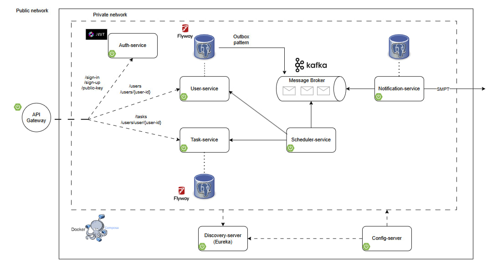

# 📝 Task Tracker (Микросервисный планировщик задач)

Многопользовательское приложение для управления задачами (аналог TODO-листа).  
Вдохновлено Trello. Поддерживает регистрацию, авторизацию (JWT), работу с задачами и уведомления по email.

---

## 🚀 Функционал
- 👤 Управление пользователями: регистрация, авторизация, logout
- ✅ Работа с задачами: создание, редактирование, отметка как выполненных, удаление
- 📧 Уведомления:
    - Приветственное письмо при регистрации
    - Ежедневная рассылка с количеством выполненных и оставшихся задач
- ⏰ Планировщик: формирование и отправка писем раз в сутки
- 📦 Outbox-паттерн для интеграции событий через Kafka

---

## 🛠️ Технологии


---

## 🏗️ Архитектура

Проект реализован в виде микросервисов:

- **config-server** — централизованная конфигурация
- **discovery-server** — сервис-реестр
- **gateway** — API Gateway для маршрутизации запросов
- **auth-service** — аутентификация и авторизация (JWT)
- **user-service** — управление пользователями
- **task-service** — работа с задачами
- **notification-service** — отправка email через Kafka
- **scheduler-service** — планировщик писем (ежедневные отчёты)

---


## 🔄 CI/CD

С помощью `github actions` все микросервисы собираются, а затем их образы пушатся на [Dockerhub](https://hub.docker.com/repositories/flomaxter).
При изменении микросервисов, происходит автоматическое обновление образов на сервере и перезапуск контейнеров. 

### Запуск приложения
> Предварительно установить:
> * [Docker desktop](https://www.docker.com/products/docker-desktop/) для поднятия окружения.
> * [Git](https://git-scm.com/) для клонирования репозитория.
> * [Java Runtime Environment (JRE) или JDK 21+](https://adoptium.net/temurin/releases/) — для запуска Spring Boot jar, если планируете запускать проект локально.

### 1. Клонировние репозитория
```bash
    git clone https://github.com/floMaxter/task-tracker-api.git
```
or download [zip-archive](https://github.com/floMaxter/task-tracker-api/archive/refs/heads/main.zip)

### 2. Переход в корневую директорию
```bash
cd task-tracker-api
```

### 3. Настройка переменных среды окружения
> В каждом микросервисе находятся .env файлы, где содержатся необходимы переменные среды окружения для старта.
> Проект может запускаться с помощью двух профилей: 
> * `local-cloud` - запуск окружения в докере, сервисы на локальной машине, 
> * `local-docker-cloud` - запуск окружения и микросервисов в докере.
> 
> Для всех микросервисов, кроме `notification-service` описаны дефолтные значения, которых хватает для тестирования приложения.
> В `notification-service` содержатся данные для обращения к внешнему SMTP сервису для отправки электронных сообшений. 
> В качестве тестирования использовался [mailtrap.io](https://mailtrap.io/).

### 4. Запуск приложение
* Если хотите запустить всё приложение в docker:
```bash
docker-compose -f docker-compose.local-docker-cloud.yml up -d
```
* Если хотите запустить только окружение:
```bash
docker-compose -f docker-compose.standalone.yml up -d
```
* А затем запустите backend локально:
```bash
./gradlew clean build -x test
java -jar build/libs/task-tracker-api-0.0.1-SNAPSHOT.jar
```

### 5. Тестирование функционала
> В пакете `http-request` лежат скрипты для обращения к едпоинтам. Для обращения к `/api/v1/auth/**` аутентификация не требуется.
> Для всех остальных запросов `/api/v1/**` необходимо быть авторизованным, что достигается путем вставки в запрос хедера с jwt токеном.
